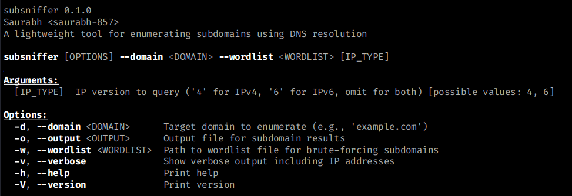

# SubSniffer


SubSniffer is a command-line tool for enumerating subdomains of a specified domain using DNS resolution. It supports both IPv4 and IPv6 lookups with custom wordlists for brute-forcing. 

## Features

- Enumerate subdomains for a given domain
- Support for IPv4, IPv6, or both address types
- Uses a wordlist for brute-forcing
- Output results to the console or a file
- Verbose mode to display IP addresses and unresolved subdomains.
- Fast and efficient using asynchronous DNS resolution
- Easy-to-use command-line interface

## Installation

### Option 1: Install via Debian Package (Kali Linux, amd64)

1. Download the latest .deb package:
    
    ```bash
    wget https://github.com/saurabh-857/subsniffer/releases/download/v0.1.0/subsniffer_0.1.0-1_amd64.deb
    ```
    
2. Install the tool:
    
    ```bash
    sudo dpkg -i subsniffer_0.1.0-1_amd64.deb
    ```
    
3. Install missing dependencies:
    
    ```bash
    sudo apt install -f
    ```
    

### Option 2: Install via Cargo

Ensure you have installed latest version of [Rust](https://www.rust-lang.org/tools/install) (recommended 1.87.0).

1. Clone the repository:
    
    ```bash
    git clone https://github.com/saurabh-857/subsniffer.git
    ```
    
2. Navigate to the project directory:
    
    ```bash
    cd subsniffer
    ```
    
3. Install the tool:
    
    ```bash
    cargo install --path .
    ```
    This installs `subsniffer` globally for the user, allowing it to be run from any directory.
    

## Usage

### Command-Line Options

Run `subsniffer -h` to display the help message:



### Examples

1. **Enumerate subdomains for example.com using a wordlist**:
	  ```bash
	subsniffer -d example.com -w wordlist.txt
	```

2. **Enumerate subdomains with verbose output and save results to a file**:
	  ```bash
	subsniffer -d example.com -w wordlist.txt -o results.txt -v
	```

3. **Enumerate subdomains querying only IPv6 addresses**:
	  ```bash
	subsniffer -d example.com -w wordlist.txt -o results.txt -v 6
	```

## Uninstallation

To remove SubSniffer from your system:

### Via Debian Package

```bash
sudo apt remove subsniffer
```

### Via Cargo

```bash
cargo uninstall subsniffer
```

## Contributing

Contributions are welcome! Please read our [CONTRIBUTING.md](./CONTRIBUTING.md) file for guidelines on how to contribute.

## License

This project is licensed under the MIT License. See the [LICENSE.md](./LICENSE.md) file for details.

## Acknowledgments

- Built with [Rust](https://www.rust-lang.org/)
- Inspired by the need for a fast and simple subdomain enumeration tool
